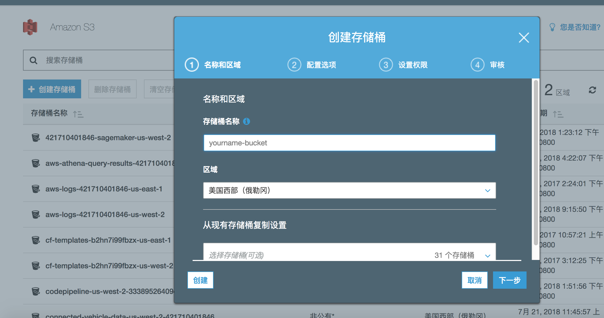
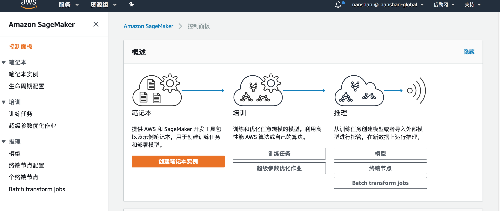
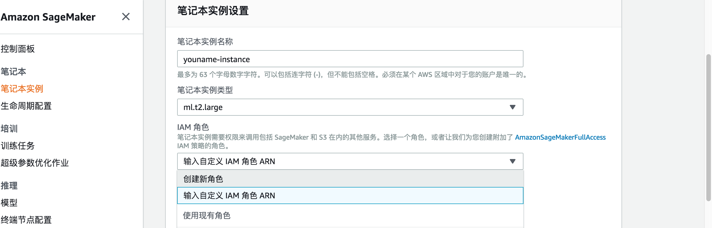
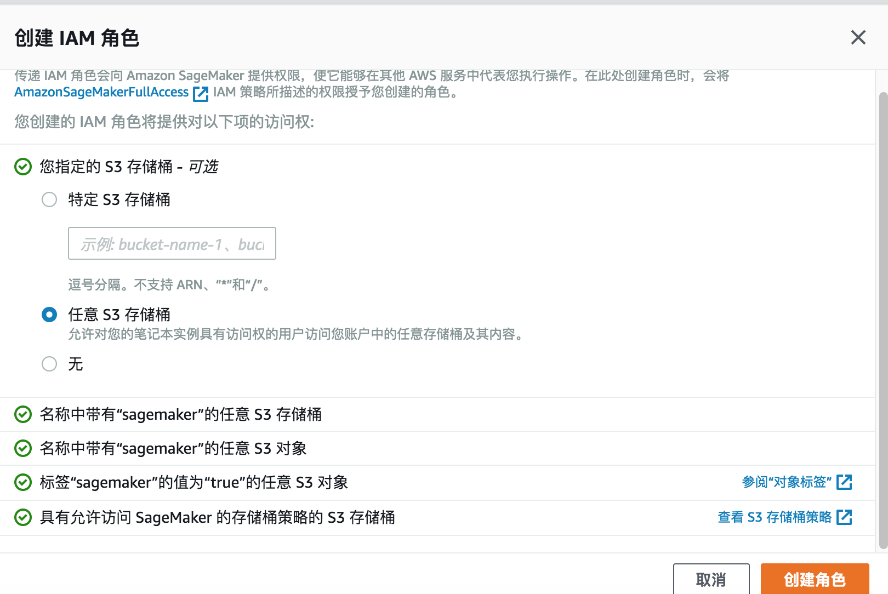
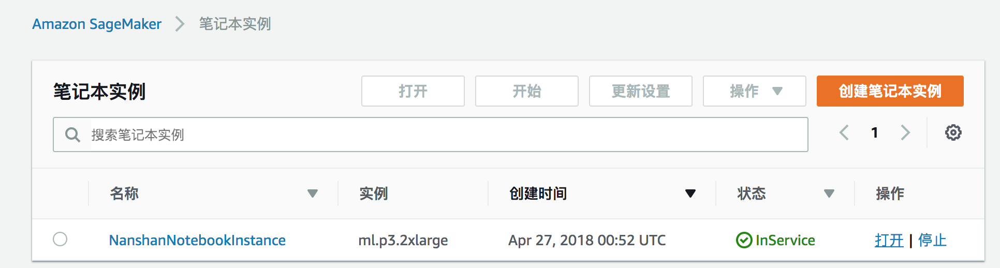
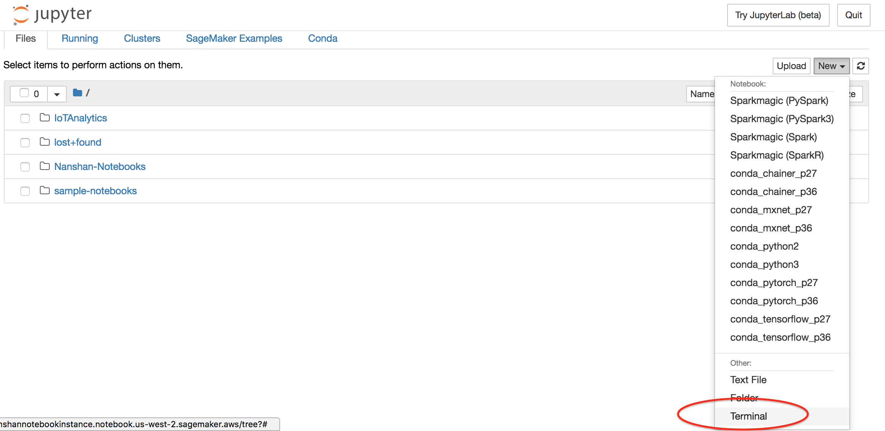
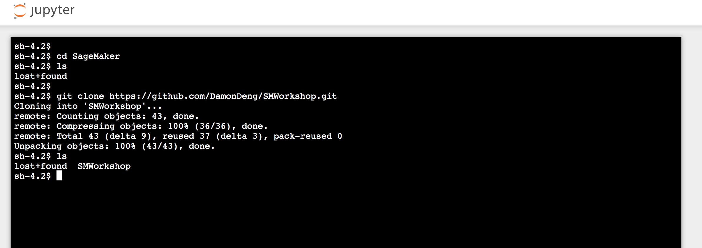
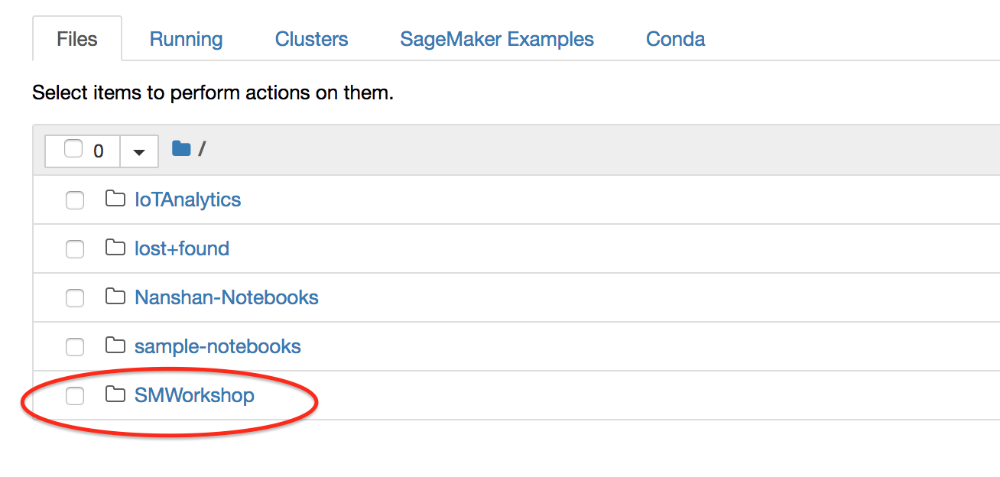

# mnist 手写数字识别机器学习 workshop
本实验通过使用AWS SageMaker分别使用K-Means算法和MXNet神经网络来对mnist手写数字进行训练和识别。

## 准备工作：

### 创建S3存储桶作为训练数据和模型存放位置
进入AWS S3控制台, 新建一个S3 bucket作为模型训练的存储桶，如yourname-sagemaker-us-west-2，记下存储桶名称，在notebook的代码中将会填入

### 创建SageMaker 笔记本实例：

进入AWS SageMaker控制台

点击创建笔记本实例，配置如下

实例名称：如DemoNotebookInstance

实例类型：ml.m4.xlarge(如果xlarge不行，换一个其他的机型，可能是账号内机器数量限制)

角色：选择创建新角色，AWS会帮助自动创建一个SageMakerFullAccess权限的角色给到SageMake服务，在“您指定的 S3 存储桶”中选择任意S3存储桶，点击创建。

其他配置选择默认

### 打开Notebook笔记本Web端

点击notebook instance 打开链接，进入Notebook Web界面

## 下载样例代码
点击新建->Terminal，在notebook上新建一个终端

使用Git工具将练习代码下载到notebook实例上，下载命令为

git clone https://github.com/DamonDeng/SMWorkshop

代码下载完成后，可以在notebook实例中看到一个SMWorkshop的文件夹如下：

##开始练习
进入SMWorkshop文件夹，打开MNIST-KMEANS.ipynb或MNIST-MXNET.ipynb文件，按照notebook中的步骤进行练习。

